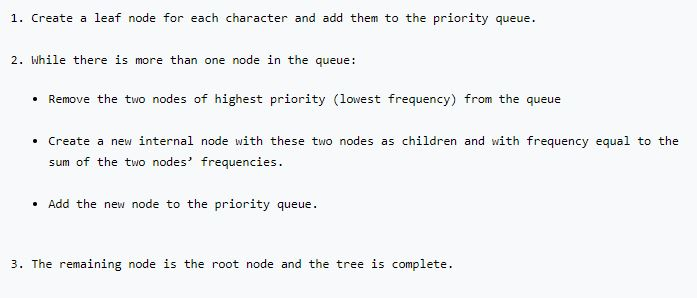
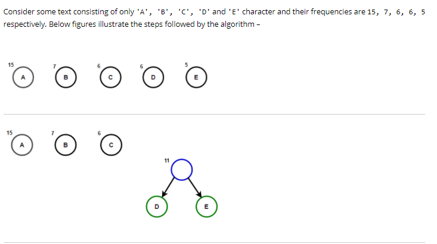
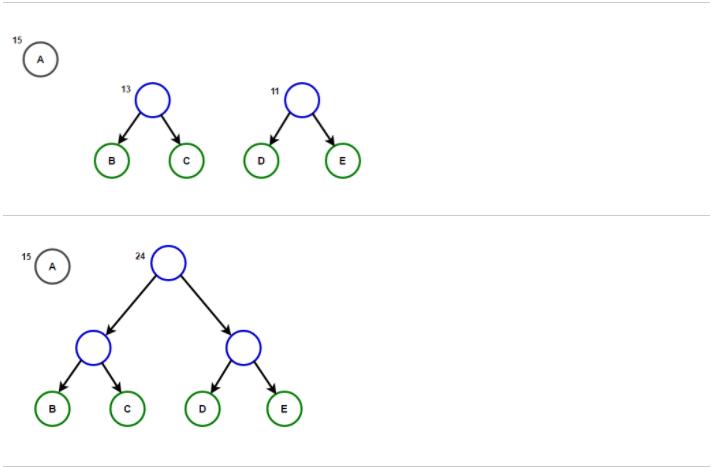
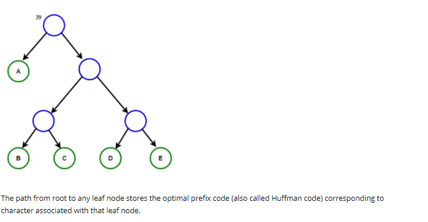
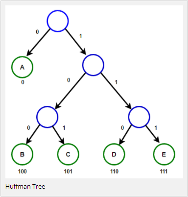
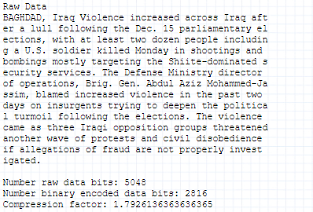
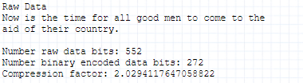

# Text_file_compressor

## What is Huffman coding?
Huffman coding is an entropy encoding algorithm used for lossless data compression. 
The term refers to the use of a variable-length code table for encoding a source symbol (such as a character in a file)
where the variable-length code table has been derived in a particular way based on the estimated probability of occurrence for each possible value of the source symbol."

## Other variable-length entropy coding systems
The idea was to use variable length encoding than using fixed length encoding. The fact that some characters occurs more frequently than others in a text, to design an algorithm which can represent the same piece of text using lesser number of bits. In variable length encoding, we assign variable number of bits to characters depending upon their frequency in the given text, so some characters might end up using only one bit.

## Prefix Free Code
The methodology used for Huffman coding results in a prefix-free code.  A prefix-free code is one in which the bit coding sequence representing some particular character is never a prefix of the bit coding sequence representing any other character.  For example, here is a possible bit sequence for a Huffman code on an alphabet with four characters where D is the most probable and A is the least probable:

## Algorithm
 
 
 

 

# Examples
 
 
